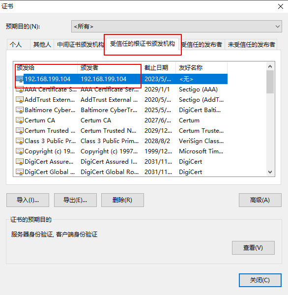
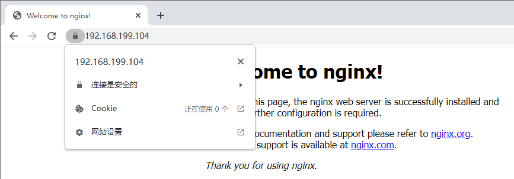

# 浏览器信任自签名证书

（1）chrome 需要添加附属文件

IP访问

```shell
cat http.ext
keyUsage = nonRepudiation, digitalSignature, keyEncipherment
extendedKeyUsage = serverAuth, clientAuth
subjectAltName=@SubjectAlternativeName

[ SubjectAlternativeName ]

IP.1=127.0.0.1

IP.2=192.168.199.104
```


域名访问

```shell
#cat http.ext
keyUsage = nonRepudiation, digitalSignature, keyEncipherment
extendedKeyUsage = serverAuth, clientAuth
subjectAltName=@SubjectAlternativeName
[ SubjectAlternativeName ]
DNS.1=super.com
DNS.2=www.super.com       

```


生成证书

```shell
openssl req -new -newkey rsa:2048 -sha256 -nodes -out 192.168.199.104.csr -keyout 192.168.199.104.key -subj "/C=CN/ST=Beijing/L=Beijing/O=Super Inc./OU=Web Security/CN=192.168.199.104"
openssl x509 -req -days 365 -in 192.168.199.104.csr -signkey 192.168.199.104.key -out 192.168.199.104.crt -extfile http.ext

req -new -newkey rsa:2048 -sha256 -nodes -out tyh.com.csr -keyout tyh.com.key -subj "/C=CN/ST=Beijing/L=Beijing/O=Super Inc./OU=Web Security/CN=*.tyh.com"
openssl x509 -req -days 365 -in tyh.com.csr -signkey tyh.com.key -out tyh.com.cer -extfile http.ext
```


导入证书



重载 **nginx** 并清除 **chrome** 缓存访问。

